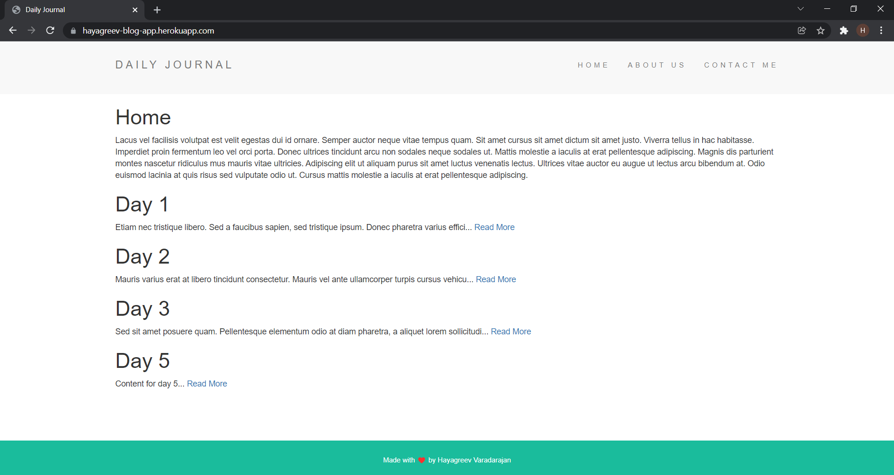
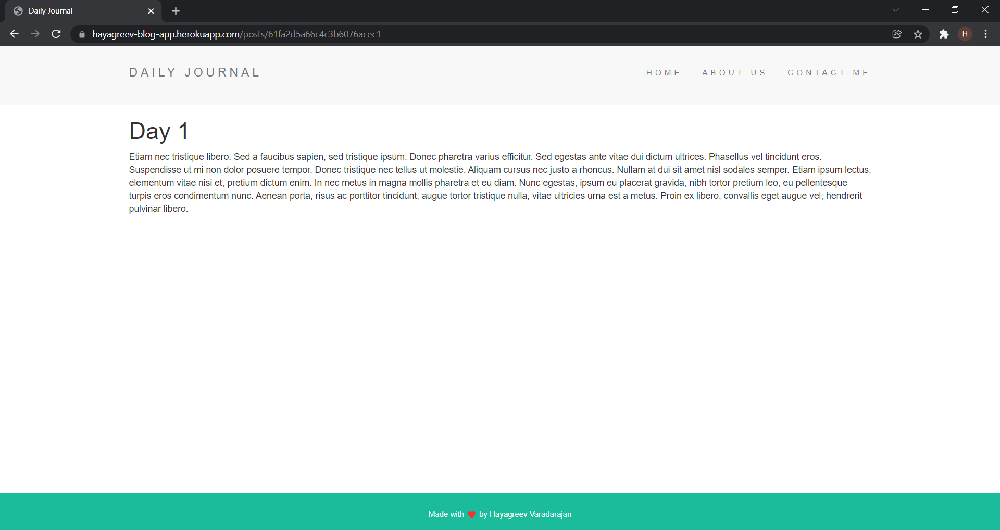
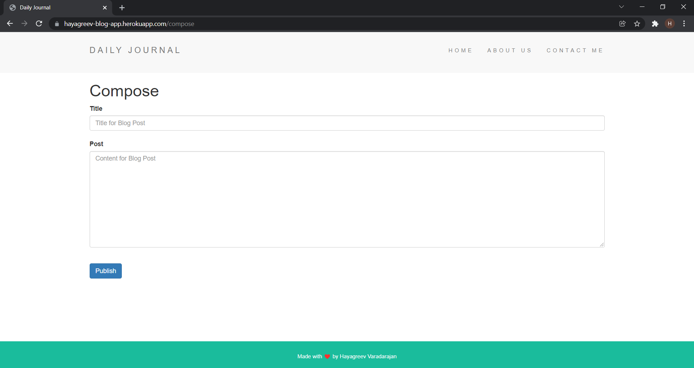

# Blog Website
This is a Blog website application that I've built. The tech stack is NodeJS and Express for the Server, MongoDB Atlas for the Database, HTML and CSS built on EJS Templating for the UI and is hosted on Heroku at https://hayagreev-blog-app.herokuapp.com/. I have NOT built the HTML and CSS. I just made use of the template that Angela Yu provided as part of her bootcamp's resoruces. I have built the Backend part completely though. I watched her videos completely and tried to build them on my own and if I'm stuck anywhere, I tried to figure it out myself and I'd only go back to the video only if I'm completely stuck and I wasn't able to figure it out at all.

P.S: As of February 3, 2022, this is a shared database for the posts. Users have not yet been added to separate your blog posts from others. I'm currently in the process of learning NodeJS fromo Angela Yu's bootcamp so this project was to get my hands dirty on something that had some basic functionality but was not too complicated. I hope to add user based blog posts in the future. Sorry for any conveniences that this might have caused.

Functionalities: This app has a home page with all the blog posts that are stored in the database. The content of the blog post is truncated to a 100 characters in the home page and is followed by a 'Read More' hyperlink. Clicking on 'Read More' will render a page with the whole content and the URL of this page would be the title of the blog post. I have achieved this using Express route parameters. You can also compose a new blog post by going to the compose route, i.e https://hayagreev-blog-app.herokuapp.com/compose. This will show a form with a Title field and the Post field. When you click on the publish button, the title and the content of the blog post will get stored in the database and you'll get redirected to the home route which will then show the new post you published as well in the home page.

# Home Page:

# Blog Post:

# Compose Page:

